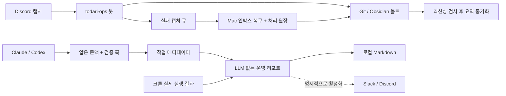

# 하네스 운영과 개선 기록

2026-09-08 로컬 코드·등록 설정·크론·사용량 메타데이터를 점검했다. 인증 파일을 출력하거나
Slack/Discord 메시지를 전송하지 않았다. 기술 문서의 정본은 이 저장소다.

## 현재 구조와 판단

### 2026-09-11: 일상 개발에서의 역할과 완료 기준

사용자는 개발 도구와 문서 사이를 수동으로 옮겨 다니지 않고, 원하는 결과를 말하면 된다.
에이전트는 관련 프로젝트 문맥을 찾아 구현·검증하고, 이번에 바뀐 판단과 다음 행동만 원래 위치에 남긴다.

| 위치 | 정본으로 남길 것 | 일상 사용 |
|---|---|---|
| 레포 | 코드, 기술 계약, 검증·배포 절차 | 구현과 검증 결과의 근거 |
| Vault | 목적, 제품 결정과 이유, 현재 상태, 다음 행동 | 다음 세션에서 이어갈 맥락 |
| Harness | 레포 매핑, 짧은 시작 문맥, 실행 결과 | 반복 탐색과 검증 누락 줄이기 |
| Ops / Discord | 캡처, 작업 진입점, 장애·복구·배포 알림 | 떠오른 일을 입력하고 필요한 결과 받기 |

1. **시작**: 현재 레포와 이미 주입된 문맥을 사용한다. workspace 루트에서 레포를 선택했다면
   해당 허브만 한 번 확인한다. 사용자가 작업을 지정한 경우 오래된 볼트 할 일로 범위를 바꾸지 않는다.
2. **진행**: 기술 설명은 레포에 남긴다. 새로운 제품 결정은 이유와 근거 링크를 허브에 남기고,
   같은 할 일을 레포·볼트·Discord에 각각 새로 만들지 않는다.
3. **완료**: 마지막 변경 이후 관련 검증의 최종 결과를 확인한다. 조건에 해당할 때만 기존 허브와
   할 일을 갱신한다. 완료 근거가 없는 오래된 체크박스는 완료 처리하지 않는다.
4. **운영 확인**: 로컬 저장, Git 동기화, Ops 요약 반영, Discord 전송은 각각 별개다.
   기록은 성공했는데 동기화만 실패했다면 기록을 다시 적용하지 않는다. 외부 전송은 요청 범위에 따른다.

허브의 선택적 `## 현재 초점`은 확인 날짜·현재 상태·최근 중요한 판단을 3줄 이내로 유지한다.
`## 다음 할 일`의 상위 3개가 다음 세션에 주입되므로 현재 우선순위를 위에 놓고 과거 항목은
근거 없이 지우지 않는다. 모든 허브를 일괄 개편하지 않고 실제로 작업한 프로젝트부터 적용한다.
매 대화 종료 시 별도 문서 작성·승인·알림을 강제하는 훅은 추가하지 않는다.

이번 로컬 개선:
- 검증: `uv/poetry/pipenv run`, `sh/bash/zsh -c` 인식, 실행 중·비정상 종료 결과를 성공에서 제외.
  Codex 문서상 비동기 완료는 원래 명령의 `Bash` PostToolUse로 전달된다. `write_stdin` 전용
  훅을 추측해 추가하지 않았다. 훅이 성공 기록을 놓쳤을 때도 이미 확보한 완료 결과를 재사용하게 안내한다.
- 볼트: 현재 초점을 제한된 길이로 주입하고, 읽기 실패를 빈 할 일 목록과 구분한다.
- 운영 리포트: 최근 실행 시각과 종료 코드를 마지막 성공과 함께 보여 주고 동기화 실패 시 확인할 일을 표시한다.

09-11 점검에서 inbox-sweep은 성공, vault-push·vault-sync는 실패, weekly-review는 기록 없음이었다.
이는 점검 시점의 로컬 원장 상태이며 원격 장애 원인을 확정하지 않는다. 섹터4 노트 읽기는 가능했지만
Vault Git 메타데이터 조회에 지연이 있어 원격 최신성을 확인하지 못했다.
성공한 자동화 수만으로 전체 연결이 정상이라고 보고하지 않는다.

검증: 전체 `test_*.py` 295개 통과, `compileall` 통과, `doctor.py` 등록 문제 0개.
기존 CLI 버전 기준 차이·오래된 레포 요약·미등록 레포 경고는 남아 있다.
섹터4 허브를 실제 SessionStart 입력으로 실행해 현재 초점과 우선 할 일 주입을 확인했다.
코드 수정 후 `register_codex.py`로 훅 리비전을 갱신했다. 등록 검사 통과와 사용자의 훅 신뢰 승인은
별개이며 변경된 훅은 Codex Hooks 화면에서 다시 검토·승인해야 한다.



전면 재작성보다, 이미 있는 저장소·훅·봇을 유지하며 유실과 측정 오류를 먼저 고친다.
Claude 기본 medium과 Codex worker 설정은 유지한다. 현재 `routing.enforcement`는 advisory다.
강제 위임은 어제 오분류·죽은 턴 때문에 완화됐으므로 측정 없이 다시 강제하지 않는다.
일반 코딩에는 주 에이전트를 유지하고, 독립 조사·검증이 실제로 병렬화될 때만 위임한다.

## 실측과 수정

| 영역 | 확인한 문제 | 반영한 개선 |
|---|---|---|
| 공통 지침 | workspace와 Codex 글로벌에 같은 규칙 중복 | workspace AGENTS는 짧은 진입 안내; 해당 규칙 문맥 문자 수 약 47.7% 감소 |
| 사용량 집계 | Claude JSONL 247개·약 1.225GB를 매번 파싱 | 기본 원문 0파일, 실제 경량 집계 약 0.37초. 상세 집계는 명시적 선택 |
| 상세 집계 | 기간보다 오래된 파일도 읽고 다른 파일의 같은 메시지를 재집계 | mtime 사전 제외(측정 약 831MB·67.8%), 전역 message ID·최신 streaming 중복 제거 |
| repo-map | fetch 이후 upstream만 바뀌면 오래된 상태 유지 | upstream 상태와 렌더러 변경을 캐시 키에 반영 |
| 훅 등록 | import한 공용 코드 변경을 리비전이 놓침 | 전이적인 로컬 Python import까지 해시 |
| Discord 큐 | 최근 100개만 조회, 미지원 형식을 task로 추측 | 페이지네이션, 조회 상한의 명시적 실패, quarantine, 제한된 재시도 |
| 캡처 복구 | 볼트 기록 후 ack 실패 시 중복 적용 | 완료 마커·경로/해시 원장, 원장이 있어야 ack; 부분 실패 보고 |
| 볼트 수집 | 포크레터 허브 누락, 별도 slug 목록 | repos.json의 vault_note/vault_slug 우선, NFC/NFD 탐색·경로 중복 제거 |
| 볼트 동기화 | 늦은 Mac 상태가 봇의 최신 상태를 덮을 수 있음 | 미커밋 Markdown/HEAD 변경/실제 remote HEAD 불일치 시 실전송 보류 |
| 크론 관측 | CLI 오류 후 exit 0, 일정 등록만으로 정상 오인 | 실제 종료·산출물 확인, 마지막 성공·실패·미실행 기록, 작업별 잠금 |
| 알림 | 하네스 공통 Slack 리포트와 전송 원장 없음 | 같은 집계의 Slack/Discord 어댑터, 일일 중복 방지, 기본 미리보기 |

2026-09-08 감사 당시 최근 7일 worker 기록은 64회: 완료 46, 시간 초과 5,
needs_review 5, failed 4, blocked 4; 평균 686.7초였다. 원본 수치이며 전체 Codex 앱 사용량은 아니다.
Claude 집계에는 캐시 읽기 약 24.6억 토큰이 포함되어 있었다. 이는 반복 요청의 누적 캐시 읽기이며
그만큼 새 입력을 결제했다는 뜻이 아니다. 문자 수 절감 역시 전체 토큰이나 비용 절감률이 아니다.

`doctor.py`는 등록 오류 0개를 확인했지만 CLI 기준 버전 차이, 오래된 Trade Tower 컨텍스트,
활동 중 미등록 레포 5개, 최근 fail-open 7회가 있었다. 미등록 레포의 배포 규칙은 추측해 추가하지 않았다.
주간 회고 로그에는 `claude not found`와 exit 0이 함께 있었고, Mac 수면 중 크론 누락도 관찰됐다.

## 운영 명령

```bash
python3 stats.py 7 --json
python3 stats.py 7 --include-claude
python3 ops_report.py report --days 1
python3 ops_report.py report --days 7 --output /path/to/report.md
python3 ops_report.py run --job weekly-review --timeout 3600 -- /bin/zsh automation/run_skill.sh weekly-review
```

일상 리포트는 LLM·대화 원문·볼트 본문 없이 수집한다. verification은 상태 파일 TTL 창,
worker는 보존된 실행 기록 범위라는 한계가 있다. 새 실행 기록이 없으면 `unknown`이며,
등록 사실이나 오래된 텍스트 로그를 성공으로 변환하지 않는다. 현재 보고는 최대 지연 기준으로
`stale`을 표시하므로 실패 즉시 외부 알림은 별도 전송 스케줄이 필요하다.

SQLite 원장: `~/.claude/cache/operations.sqlite3`. job 상태·마지막 성공·종료 코드,
캡처 ID/경로/해시, 전송 대상의 해시/일일 키만 저장한다. 명령 원문·인증값·노트 본문은 저장하지 않는다.
동일 작업은 프로세스 잠금으로 막으며 timeout은 하위 프로세스 그룹에도 종료 신호를 보낸다.
중단된 그룹 정리를 OS가 확인해주지 못하면 오류를 남기고 실패로 처리한다.

## Slack·Discord 전송

설치만으로 외부 전송하지 않는다. 채널을 정하고 다음 환경변수를 안전한 실행 환경에 설정한 뒤,
미리보기 내용을 확인하여 명시적으로 `--send`를 사용한다. URL을 대화나 문서에 붙이지 않는다.

- Slack: `HARNESS_SLACK_WEBHOOK_URL`
- Discord: `HARNESS_DISCORD_WEBHOOK_URL`

```bash
python3 ops_report.py report --channel slack --send
python3 ops_report.py report --channel discord --send
```

기본 delivery key는 로컬 날짜별 daily이며 대상별 한 번만 보낸다. HTTP 실패 후 재시도는
`--retry-failed`로 선택한다. 전송 응답이 끊기면 이미 게시되었을 수 있으므로 `uncertain`으로
남기고 자동 재전송하지 않는다. 채널에서 게시 여부를 확인하기 전 새 key로 우회하지 않는다.
Slack는 plain_text 블록, Discord는 allowed_mentions=[]로 멘션을 막는다. webhook redirect를 따르지 않는다.

기본 운영 접점은 사용 중인 Discord로 유지한다. 새로운 Slack 채널이나 매 작업 완료 알림을
추가할 필요는 없다. 일일 집계가 실제로 필요할 때 기존 리포트를 선택해 연결한다.
Obsidian에는 조건에 해당하는 결정·상태·다음 행동을 남기며 모든 소스·툴 결과를 복제하지 않는다.

## 인박스와 볼트 복구

`automation/skills/inbox-sweep/SKILL.md`가 복구 절차의 원본이다. Codex 쪽 스킬은 Claude 스킬의
기존 심볼릭 링크를 유지한다. 주간 회고에서는 커밋 전체 대신 레포당 변화와 미해결 행동을 압축하고,
프로젝트 허브는 `repos.json`을 따라 찾는다.

- `inbox_fetch.py list --max-pages 20`: 최대 2,000개 범위. 전체 탐색을 완료하지 못하면 실패한다.
  오래된 큐가 더 크면 검토 후 max-pages를 늘린다. 실패를 빈 큐로 취급하지 않는다.
- 노트에 완료 마커 `<!-- inbox:discord:ID -->`를 남긴 뒤
  `ops_report.py receipt written ID --note "상대경로.md"`로 확인한다.
- 여러 노트를 바꾸는 항목은 대상·진행을 로컬 복구 메모에 두고 **모든 변경 검증 후** 마지막에 완료 마커를 쓴다.
- `inbox_fetch.py ack ID`는 원장 확인 후 idempotent PUT을 수행한다. ack만 실패하면 기록은 다시 하지 않는다.
- `vault_sync.py --dry-run`은 로컬 수집 미리보기이며 네트워크를 사용하지 않는다.
- 실전송은 깨끗한 Markdown과 현재 원격 HEAD의 일치를 요구한다. 보류 시 강제 push/자동 commit 대신
  Obsidian Git 동기화·충돌을 확인하고 다시 실행한다.

## 남은 경계와 다음 실험

1. Mac 수면 중에는 기존 cron이 실행되지 않는다. 마지막 성공으로 발견할 수 있지만 자동 따라잡기는
   아직 없다. launchd 이전 또는 EC2 heartbeat 감시를 후속 범위로 다룬다.
2. sender의 원격 확인 직후 봇이 새 커밋을 만들 수 있다. 완전한 동시성 보호는 수신 봇에서
   `sourceRevision`을 검증하는 작업과 배포가 필요하다. `generatedAt`을 로컬 태스크 변경 시 갱신하는
   봇의 기존 동작도 sourceSyncedAt/lastMutationAt으로 나누는 것이 다음 단계다.
3. todari-ops의 `capture.ts`에는 Git 기록 성공 뒤 요약 저장만 실패한 task를 다시 큐에 넣지 않는
   수정과 회귀 테스트를 준비했다. 배포는 이 작업에서 수행하지 않는다.
4. 상세 Claude 집계는 여전히 기간 내 파일 전체를 읽는다. 일상 집계는 이미 가벼워졌으므로
   append offset 캐시·SQLite 검색 인덱스는 실제 병목을 재측정한 뒤 도입한다.
5. 볼트 검색의 권한 오류/부분 읽기를 0건과 구분하는 개선, 주간 회고 스킬의 허브 범위 통일은 남아 있다.
6. 7일 뒤 완료율·timeout·평균 작업 시간·Claude 비캐시 입력·사람이 되돌린 기록 수로 효과를 평가한다.
   더 강한 모델·강제 위임·추가 MCP를 기본값으로 늘리기 전에 이 지표를 비교한다.

## 공식 근거

- [OpenAI customization](https://learn.chatgpt.com/docs/customization/overview): 작은 공통 지침과 역할별 확장 수단.
- [Codex hooks 설정](https://learn.chatgpt.com/docs/config-file/config-advanced#hooks): config layer와 훅 등록 범위.
- [Claude hooks](https://code.claude.com/docs/en/hooks): 이벤트·timeout·비동기 훅의 실행 수명.
- [Slack incoming webhooks](https://docs.slack.dev/messaging/sending-messages-using-incoming-webhooks/): 채널에 귀속된 webhook과 오류 처리.
- [Discord webhooks](https://docs.discord.com/developers/resources/webhook#execute-webhook): wait 응답과 메시지 옵션.
